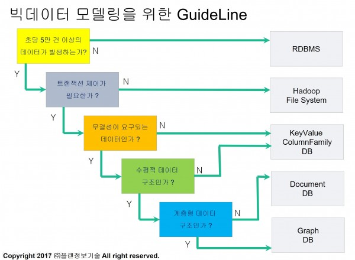

# NoSQL & Redis 소개
## 1. NoSQL 개념
"no SQL"보다는 "Not only SQL"
### 특징
1. 클라우드 컴퓨팅 환경에 적합
2. 유연한 데이터 모델(제약이 적다)
3. 빅데이터 처리에 효과적

## 2. NoSQL 종류
- Key-Value DB - Redis
- Column-Family DB - Cassandra
- Document DB - Mongo DB
- Graph DB - AllegroGraph

출처: http://pitmongo.co.kr/bbs/board.php?bo_table=h_notice&wr_id=36

## 3. Key-Value DB
### 특징
1. In-Memory 기반의 데이터 저장 구조   
-> 기존의 RDBMS와 같은 파일 기반 데이터 저장 구조와 달리, 1차적으로 모든 데이터는 메모리에 저장되고 선택적으로 디스크에 존재하는 파일에 저장되며, DBMS에 의해 할당되거나 자동 관리되지 않음.
2. 하나의 Key와 데이터 값으로 구성
3. 가공처리가 요구되는 비즈니스 환경에 적합
### 활용 영역
1. 실시간 분석
2. IOT
3. 계측 정보수집
4. 개인화 정보관리
5. 전자 상거래 비즈니스
